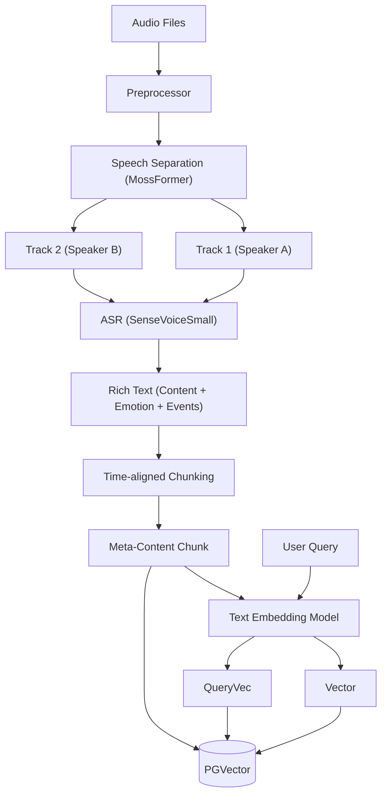

# Audio RAG Algorithm Specification

## 1. 概述 (Overview)

音频 RAG 的核心是将非结构化的音频数据转化为结构化的文本和向量表示。本方案采用 **"Separation + ASR (Rich Text) -> Meta-Content Chunk"** 的策略。

利用阿里开源的 **MossFormer** 进行语音分离，再使用 **SenseVoiceSmall** 进行高精度语音识别（包含情感和环境音检测），最终形成带有丰富元数据且时序对齐的 Meta-Content Chunk，通过文本向量模型进行索引。

## 2. 架构流程 (Architecture Pipeline)



## 3. 核心组件 (Core Components)

### 3.1 预处理与语音分离 (Preprocessing & Separation)

*   **Format Normalization**: 转换为模型支持的格式（如 WAV, 16kHz/8kHz）。
*   **Speech Separation (语音分离)**:
    *   **Model**: **MossFormer** (`iic/speech_mossformer_separation_temporal_8k`)。
    *   **Purpose**: 解决多说话人重叠、背景噪声干扰问题。
    *   **Process**: 将单通道混合音频分离为多个独立的纯净人声音轨。这比传统的 Speaker Diarization 更进一步，能处理同时说话的情况。

### 3.2 语音转文本与富文本识别 (ASR & Rich Transcription)

*   **ASR Model**: **SenseVoiceSmall** (`iic/SenseVoiceSmall`).
    *   **Capabilities**:
        *   **多语言识别**: 支持中、英、粤、日、韩等 50+ 种语言。
        *   **情感识别 (SER)**: 识别说话人的情感（如开心、悲伤、愤怒）。
        *   **音频事件检测 (AED)**: 识别非语言声音（如掌声、笑声、咳嗽、音乐）。
        *   **极低延迟**: 10s 音频仅需 70ms。
    *   **Output**: 带有时间戳、情感标签、事件标签的富文本流。

### 3.3 索引策略 (Indexing Strategy)

采用 **Meta-Content Chunking** 策略，确保向量化内容具备完整的上下文和时序信息。

1.  **Time-aligned Chunking (时序切割)**:
    *   **Strategy**: 不对整个长音频直接向量化。基于 ASR 输出的时间戳，按固定时间窗口（如 30s-60s）或语义停顿点（句号、静音段）进行切割。
    *   **Alignment**: 确保每个 Chunk 内部的时间是连续的，且保留了原始的时序结构。

2.  **Meta-Content Formation (元内容构建)**:
    *   将 ASR 识别的内容（文本）与元数据（情感、事件、时间、说话人）整合成一个结构化的文本块。

    ```markdown
    <meta>
    [Source]: meeting_rec_001.wav
    [Track]: Speaker_A
    [Time_Range]: 00:05:30 - 00:06:00
    [Emotion]: Happy
    [Events]: Applause, Laughter
    </meta>

    <content>
    [05:30] 这是一个非常棒的提议！<Laughter> 我完全同意你的观点。
    [05:45] 让我们为这个决定鼓掌。<Applause>
    [05:50] 接下来我们讨论下一个议题。
    </content>
    ```

3.  **Vectorization (向量化)**:
    *   使用通用的文本 Embedding 模型（如 text-embedding-3-large）对上述 **Meta-Content Chunk** 进行编码。
    *   这样，用户搜索“开心的讨论”或“掌声片段”时，向量模型能捕捉到 Meta 信息中的语义。

### 3.4 存储 (Storage)

```sql
CREATE TABLE rag_audio_files (
    id UUID PRIMARY KEY DEFAULT gen_random_uuid(),
    collection_id UUID NOT NULL,
    file_path TEXT NOT NULL,
    duration FLOAT,
    metadata JSONB,
    created_at TIMESTAMP DEFAULT NOW()
);

CREATE TABLE rag_audio_chunks (
    id UUID PRIMARY KEY DEFAULT gen_random_uuid(),
    audio_id UUID REFERENCES rag_audio_files(id),
    
    -- 核心检索内容
    meta_content TEXT NOT NULL, -- 完整的 Meta-Content 文本
    vector VECTOR(1536),        -- 对应的文本向量
    
    -- 结构化字段 (用于精确过滤)
    start_time FLOAT,
    end_time FLOAT,
    track_id INTEGER,           -- 分离后的音轨 ID
    emotions TEXT[],            -- 检测到的情感列表
    events TEXT[],              -- 检测到的事件列表 (Applause, Laughter...)
    
    raw_text TEXT,              -- 纯文本内容 (无标签)
    
    created_at TIMESTAMP DEFAULT NOW()
);

CREATE INDEX ON rag_audio_chunks USING hnsw (vector vector_cosine_ops);
```

## 4. 检索流程 (Retrieval Process)

1.  **Query**: 用户输入文本（例如：“找到大家鼓掌的那段会议记录”）。
2.  **Embedding**: Query 转为 Vector。
3.  **Search**: 在 `rag_audio_chunks` 表中搜索相似度最高的 Chunk。
4.  **Result**: 返回 Chunk，包含时间范围、情感、事件和对应的文本。前端可根据 `start_time` 直接跳转播放原始音频的对应片段。

## 5. 接口定义 (Interface Definition)

```typescript
interface IAudioRAGService {
  /**
   * 音频处理与索引流程：
   * 1. MossFormer 分离音轨
   * 2. SenseVoice 识别 (Text + Emotion + Event)
   * 3. 切割为 Meta-Content Chunks
   * 4. Embedding & Storage
   */
  ingest(audioFile: File, options: AudioIngestionOptions): Promise<AudioId>;
  
  /**
   * 检索
   */
  search(query: string, options: SearchOptions): Promise<AudioChunkResult[]>;
  
  /**
   * 获取音频流片段
   */
  getStream(audioId: string, start: number, end: number): Promise<ReadableStream>;
}
```
