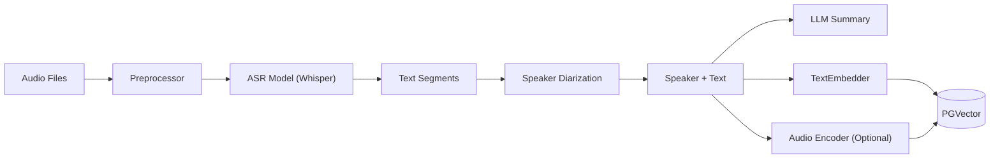

# Audio RAG Algorithm Specification

## 1. 概述 (Overview)

音频 RAG 的核心是将非结构化的音频数据转化为结构化的文本和向量表示。这使得我们可以像检索文本一样检索音频内容。

## 2. 架构流程 (Architecture Pipeline)



## 3. 核心组件 (Core Components)

### 3.1 预处理 (Preprocessing)

*   **Format Normalization**: 转换为 WAV/MP3, 16kHz 采样率 (Whisper 推荐)。
*   **VAD (Voice Activity Detection)**: 去除静音片段，减少处理量。

### 3.2 语音转文本 (ASR & Processing)

*   **ASR Model**: 使用 **OpenAI Whisper** (v3)。
    *   生成带有时间戳的文本片段 (Segments with timestamps)。
*   **Speaker Diarization (说话人分离)**:
    *   使用 **Pyannote.audio** 或类似库，识别不同说话人 (Speaker A, Speaker B)。
    *   将 Speaker ID 关联到文本片段。

### 3.3 索引策略 (Indexing Strategy)

1.  **Transcript Indexing (文本索引)**:
    *   将 ASR 生成的文本片段进行切分 (Chunking)。
    *   Chunk 包含：Text, Start Time, End Time, Speaker ID, Source File ID。
    *   进行 Text Embedding 存入向量库。

2.  **Summary Indexing (摘要索引)**:
    *   对长音频生成摘要 (Summary)。
    *   对摘要进行 Embedding。
    *   用途：当 Query 涉及宏观内容时，先检索摘要，再定位细节。

3.  **Audio Content Indexing (声学索引 - 可选)**:
    *   使用音频编码器 (如 CLAP - Contrastive Language-Audio Pretraining) 提取音频特征（如“掌声”、“狗叫声”、“悲伤的语调”）。
    *   用途：支持非语言内容的检索 (e.g., "Find the part with laughter").

### 3.4 存储 (Storage)

Schema 设计：

```sql
CREATE TABLE rag_audio_files (
    id UUID PRIMARY KEY DEFAULT gen_random_uuid(),
    collection_id UUID NOT NULL,
    file_path TEXT NOT NULL,
    duration FLOAT,
    metadata JSONB, -- 录音时间、地点等
    summary TEXT, -- 全文摘要
    summary_vector VECTOR(1536)
);

CREATE TABLE rag_audio_segments (
    id UUID PRIMARY KEY DEFAULT gen_random_uuid(),
    audio_id UUID REFERENCES rag_audio_files(id),
    content TEXT NOT NULL, -- 转录文本
    vector VECTOR(1536), -- 文本向量
    
    start_time FLOAT,
    end_time FLOAT,
    speaker_label TEXT,
    
    -- 可选：声学特征
    acoustic_vector VECTOR(512), 
    
    created_at TIMESTAMP DEFAULT NOW()
);
```

### 3.5 检索与生成 (Retrieval & Generation)

1.  **Search**:
    *   用户输入文本 Query。
    *   检索 `rag_audio_segments` 获取最相关的文本片段。
    *   返回结果包含：文本内容 + 时间戳 + 音频播放链接（定位到对应时间点）。

2.  **Generation (RAG)**:
    *   Context = 检索到的转录文本片段。
    *   Prompt: "Based on the following meeting transcript segments..."

## 4. 接口定义 (Interface Definition)

```typescript
interface IAudioRAGService {
  // 索引
  ingest(audioFile: File, options: AudioOptions): Promise<AudioId>;
  
  // 检索
  search(query: string, options: SearchOptions): Promise<AudioSegment[]>;
  
  // 获取特定时间段的音频流
  getStream(audioId: string, start: number, end: number): Promise<ReadableStream>;
}
```
