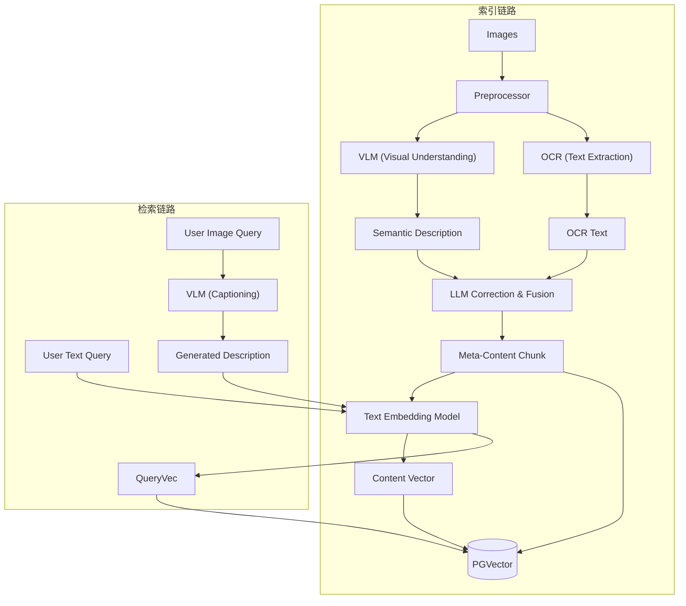

# Image RAG Algorithm Specification

## 1. 概述 (Overview)

图片 RAG 旨在实现对图片内容的深度语义理解和检索。本方案采用 **"VLM + OCR -> LLM Fusion"** 的策略，将图片转化为高质量的文本 Chunk，通过成熟的文本 RAG 链路进行索引和检索。

核心理念是将“视觉信息”转化为“语义文本”，利用 LLM 强大的理解能力对 VLM 生成的描述和 OCR 提取的文字进行纠偏与整合，形成一份结构化的 Meta-Content Chunk。无论是文本搜图还是以图搜图，本质上都统一为**文本语义检索**。

## 2. 架构流程 (Architecture Pipeline)



## 3. 核心组件 (Core Components)

### 3.1 预处理 (Preprocessing)

*   **Format Conversion**: 统一转换为 JPG/PNG。
*   **Resizing**: 调整大小以适应 VLM 和 OCR 模型的最佳输入分辨率。

### 3.2 内容提取与融合 (Extraction & Fusion)

本方案不依赖纯视觉向量（如 CLIP），而是专注于生成高质量的文本描述。

1.  **Semantic Extraction (VLM)**:
    *   使用 **VLM (Vision Language Model)** (如 GPT-4o, Claude 3.5 Sonnet, LLaVA) 对图片进行详细描述。
    *   重点关注：场景、物体、关系、氛围以及图片中隐含的意图。

2.  **Text Extraction (OCR)**:
    *   使用 **OCR** 引擎提取图片中的所有可见文字。
    *   保留文字的空间位置信息（如果可能），辅助 LLM 理解排版。

3.  **LLM Correction & Fusion (核心步骤)**:
    *   **Input**: VLM 生成的语义描述 + OCR 提取的原始文本。
    *   **Process**: 使用 LLM (如 GPT-4o, DeepSeek-V3) 进行处理：
        *   **纠偏**: 利用 VLM 的语义上下文修正 OCR 的识别错误（例如将 "0pen" 修正为 "Open"）。
        *   **融合**: 将孤立的 OCR 文本融入到场景描述中（例如“图片左上角的招牌上写着...”）。
        *   **结构化**: 生成符合 **Meta-Content** 格式的最终 Chunk。

### 3.3 Meta-Content Chunk 格式

最终生成的 Chunk 是一份包含元数据和内容的结构化文本，用于向量化。

```markdown
<meta>
[Source]: file_path/image_name.jpg
[Type]: Image/Screenshot/Diagram
[OCR_Confidence]: High/Medium/Low
[Keywords]: keyword1, keyword2, ...
</meta>

<content>
这是一张关于[主题]的图片。
场景描述：[VLM 详细描述，包含视觉元素、颜色、布局]。
文字内容：图片中包含以下关键信息：[经过 LLM 修正和整理的 OCR 内容]。
总结：[图片的核心含义或用途]。
</content>
```

### 3.4 向量化 (Embedding)

*   **Model**: 使用通用的文本 Embedding 模型 (如 OpenAI text-embedding-3-large, BGE-M3)。
*   **Input**: 上述生成的 **Meta-Content Chunk** 纯文本。
*   **Output**: 高维稠密向量 (Dense Vector)。

### 3.5 存储 (Storage)

```sql
CREATE TABLE rag_images (
    id UUID PRIMARY KEY DEFAULT gen_random_uuid(),
    collection_id UUID NOT NULL,
    file_path TEXT NOT NULL,
    
    -- 原始提取数据 (用于调试或重新生成)
    raw_ocr_text TEXT,
    raw_vlm_caption TEXT,
    
    -- 最终处理数据
    content_chunk TEXT, -- Meta-Content 格式文本
    content_vector VECTOR(1536), -- 文本向量 (维度视模型而定)
    
    metadata JSONB,
    created_at TIMESTAMP DEFAULT NOW()
);

CREATE INDEX ON rag_images USING hnsw (content_vector vector_cosine_ops);
```

## 4. 检索策略 (Retrieval Strategy)

本方案统一将所有输入（文本或图片）转换为文本向量进行检索。

### 4.1 Text-to-Image (文本搜图)

1.  **Query Processing**: 用户输入的文本 Query 转换为 Vector。
2.  **Vector Search**: 在 `content_vector` 上进行相似度搜索（Cosine Similarity）。
3.  **Result**: 返回最相关的图片 Chunk 及其对应的原始图片。

### 4.2 Image-to-Image (以图搜图)

利用 **Image-to-Text** 的思路，将“视觉相似性”转化为“语义相似性”：

1.  **Captioning**: 将用户上传的查询图片输入 VLM，生成详细的语义描述。
2.  **Conversion**: 将生成的描述作为文本 Query。
3.  **Search**: 执行上述的 Text-to-Text 向量检索。
4.  **Advantage**: 这种方式能更好地理解查询图片的“意图”（例如：用户上传一张猫的照片，VLM 会描述“一只橘猫在睡觉”，检索结果会匹配语义上相似的图片，而不仅仅是像素或低级视觉特征相似）。

### 4.3 Visual QA (图片问答)

1.  **Retrieve**: 根据用户问题（Text）或参考图片（Image）检索相关图片 Chunk。
2.  **Answer**: 将检索到的图片 Chunk 内容（甚至配合原始图片）+ 用户问题一起输入 LLM 生成答案。

## 5. 接口定义 (Interface Definition)

```typescript
interface IImageRAGService {
  /**
   * 图片入库流程：
   * 1. Preprocess
   * 2. VLM Captioning
   * 3. OCR
   * 4. LLM Fusion (-> Meta-Content Chunk)
   * 5. Embedding
   * 6. Save to DB
   */
  ingest(imageFile: File, options: ImageIngestionOptions): Promise<ImageId>;
  
  /**
   * 检索流程：
   * Case A (Text Query): Query -> Embedding -> Search
   * Case B (Image Query): Image -> VLM -> Caption -> Embedding -> Search
   */
  search(query: string | File, options: SearchOptions): Promise<ImageResult[]>;
}
```
