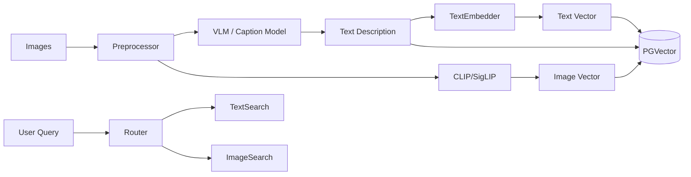

# Image RAG Algorithm Specification

## 1. 概述 (Overview)

图片 RAG 旨在实现对图片内容的语义理解和检索。系统不仅要能根据文本描述找到图片（Text-to-Image Retrieval），还要能根据图片找到相似图片（Image-to-Image Retrieval），并支持基于图片内容的问答（Visual QA）。

## 2. 架构流程 (Architecture Pipeline)



## 3. 核心组件 (Core Components)

### 3.1 预处理 (Preprocessing)

*   **Format Conversion**: 统一转换为 JPG/PNG。
*   **Resizing**: 调整大小以适应模型输入（如 CLIP 需要 224x224 或 336x336）。
*   **OCR (Optional)**: 如果图片包含文字，使用 OCR 提取文本内容，作为额外的 metadata 或 content。

### 3.2 特征提取与向量化 (Feature Extraction & Embedding)

采用 **双路索引策略 (Dual-Path Indexing)**：

1.  **Dense Visual Embedding (视觉向量)**:
    *   使用 **CLIP (Contrastive Language-Image Pre-training)** 或 **SigLIP** 模型。
    *   将图片映射到与文本共享的向量空间。
    *   用途：支持 Text-to-Image 和 Image-to-Image 检索。

2.  **Generative Captioning (生成式描述)**:
    *   使用 **VLM (Vision Language Model)** 如 GPT-4o, Claude 3.5 Sonnet, 或开源的 LLaVA, BakLLaVA。
    *   生成详细的图片描述（Caption）。
    *   用途：增强语义理解，支持更复杂的逻辑查询（这是 CLIP 难以做到的）。
    *   将 Caption 作为文本进行 Embedding 存储。

### 3.3 存储 (Storage)

Schema 扩展：

```sql
CREATE TABLE rag_images (
    id UUID PRIMARY KEY DEFAULT gen_random_uuid(),
    collection_id UUID NOT NULL,
    file_path TEXT NOT NULL, -- 对象存储路径
    thumbnail_path TEXT,
    width INTEGER,
    height INTEGER,
    
    -- 视觉向量
    visual_vector VECTOR(512), -- CLIP ViT-B/32 维度
    
    -- 生成的描述
    caption TEXT,
    caption_vector VECTOR(1536), -- 文本向量维度
    
    -- OCR 提取的文字
    ocr_text TEXT,
    ocr_vector VECTOR(1536),
    
    metadata JSONB,
    created_at TIMESTAMP DEFAULT NOW()
);

CREATE INDEX ON rag_images USING hnsw (visual_vector vector_cosine_ops);
CREATE INDEX ON rag_images USING hnsw (caption_vector vector_cosine_ops);
```

### 3.4 检索策略 (Retrieval Strategy)

1.  **Text-to-Image (文本搜图)**:
    *   **Coarse Search**: 将 Query 转换为 Text Embedding，在 `visual_vector` 空间搜索（利用 CLIP 的图文对齐特性）。
    *   **Fine Search**: 将 Query 转换为 Text Embedding，在 `caption_vector` 空间搜索（利用 VLM 生成的详细描述）。
    *   **Fusion**: 对两种搜索结果进行加权融合 (Reciprocal Rank Fusion, RRF)。

2.  **Image-to-Image (以图搜图)**:
    *   计算 Input Image 的 CLIP Embedding，在 `visual_vector` 空间搜索。

3.  **Visual QA (图片问答)**:
    *   检索相关图片。
    *   将检索到的图片 + 用户 Query 一起输入给 VLM (如 GPT-4o)。
    *   VLM 生成答案。

## 4. 接口定义 (Interface Definition)

```typescript
interface IImageRAGService {
  // 索引
  ingest(imageFile: File, options: ImageIngestionOptions): Promise<ImageId>;
  
  // 检索
  search(query: string | Image, options: SearchOptions): Promise<ImageResult[]>;
  
  // 问答
  chatWithImage(query: string, imageContext: ImageId[]): Promise<string>;
}
```
