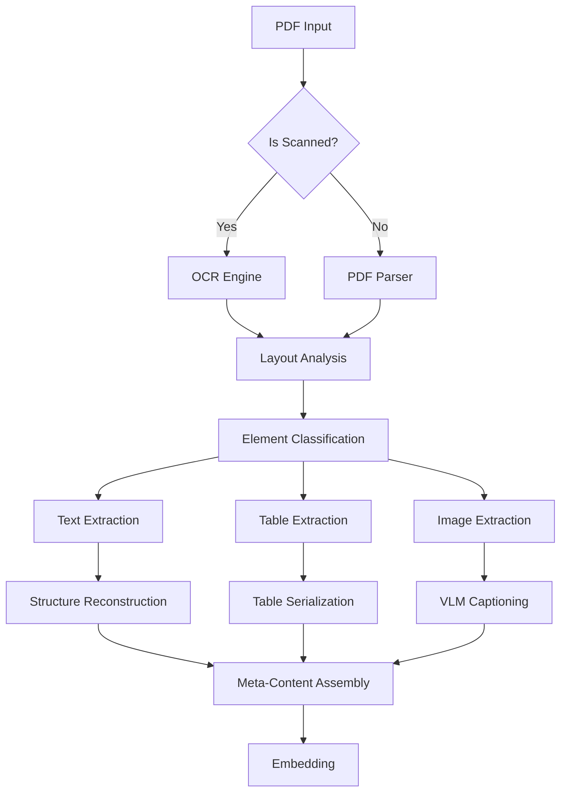

# PDF 文档处理与 Meta-Content 构建策略

## 1. 概述 (Overview)

PDF (Portable Document Format) 是企业和学术界最常用的文档格式，但其本质是面向打印的视觉描述语言，缺乏语义结构。直接提取文本往往导致阅读顺序混乱、表格数据丢失、页眉页脚噪音等问题。

本规范定义了高质量 PDF 处理流水线，旨在将非结构化的 PDF 转换为高语义密度的 **Meta-Content**。

## 2. 处理流水线 (Processing Pipeline)



## 3. 核心挑战与解决方案

| 挑战 | 现象 | 解决方案 |
| :--- | :--- | :--- |
| **阅读顺序** | 多栏排版被横向合并，导致语句不通 | 使用基于布局分析的解析器 (如 Microsoft Azure DI, Surya, LayoutLM) 识别 Text Block 顺序。 |
| **表格丢失** | 表格被解析为散乱的文本行，失去行列关系 | 专门的表格识别模型，将表格转换为 Markdown/HTML/CSV 格式。 |
| **信息碎片** | 跨页断句，代词指代不明 | 滑动窗口 + 上下文补全 (Contextual Retrieval)。 |
| **噪音干扰** | 页眉、页脚、页码混入正文 | 基于坐标 (BBox) 过滤页面边缘区域的文本。 |

## 4. Meta-Content 构建策略 (关键)

Meta-Content 是输入给 Embedding 模型的最终文本。为了提高检索质量，必须在原始文本基础上注入**元数据 (Metadata)** 和 **上下文 (Context)**。

### 4.1 文本块 (Text Blocks)

对于普通文本段落，Meta-Content 应包含其所属的文档层级结构。

*   **原始文本**: `它在测试集上达到了 98.5% 的准确率。`
*   **结构化增强**:
    *   识别该段落所属的章节 (Section)。
    *   识别该段落所属的页面 (Page)。
*   **Meta-Content 格式**:
    ```xml
    <meta>
    Filename: research_paper_v1.pdf
    Page: 4
    Section: 3. Experiments > 3.2 Results > 3.2.1 Accuracy
    </meta>
    <content>
    它在测试集上达到了 98.5% 的准确率。
    </content>
    ```
    *(注：Embedding 时，可以将 Field Name 去掉以减少噪音，或者保留以增强语义，取决于模型偏好)*

### 4.2 表格 (Tables)

表格是 RAG 的难点。仅仅 Embedding 表格的 Markdown 源码往往效果不佳，因为数字本身缺乏语义。

*   **处理方式**:
    1.  **Serialization**: 转为 Markdown 或 HTML。
    2.  **Summarization**: 使用 LLM 生成表格的自然语言描述。
*   **Meta-Content 格式**:
    ```text
    Type: Table
    Caption: Table 1: Performance comparison of different models on ImageNet.
    Summary: 该表格比较了 ResNet-50, ViT-B/16 和 Ours 模型在 ImageNet 数据集上的 Top-1 和 Top-5 准确率。Ours 模型在 Top-1 上达到了 85.2%，优于 ResNet-50 的 76.1%。
    Content:
    | Model | Top-1 | Top-5 |
    |-------|-------|-------|
    | ResNet| 76.1  | 92.9  |
    | ...   | ...   | ...   |
    ```

### 4.3 图片与图表 (Images & Charts)

*   **处理方式**: 使用 VLM (如 GPT-4o, Claude 3.5 Sonnet, Qwen-VL) 生成详细 Caption。
*   **Meta-Content 格式**:
    ```xml
    <meta>
    Type: Image
    Location: Page 5
    Caption: Figure 3: System Architecture.
    Description: 这是一张系统架构图，展示了数据从 Input Layer 流向 Encoder，经过 Self-Attention 机制，最后由 Decoder 输出预测结果的流程。图中包含三个主要模块...
    </meta>
    <content>
    (图中提取的文字标签)
    </content>
    ```

## 5. 推荐工具栈

1.  **解析与布局分析**:
    *   **商业**: Microsoft Azure AI Document Intelligence (最佳效果), Amazon Textract.
    *   **开源**: `Unstructured.io`, `Surya` (OCR/Layout), `PyMuPDF` (基础提取).
2.  **表格提取**:
    *   `Gmft` (Grid Matching for Tables), `Camelot` (针对线条表格).
3.  **VLM (用于图片描述)**:
    *   `GPT-4o-mini` (性价比高), `Qwen2-VL`.

## 6. 示例：论文处理 (Paper Processing)

假设输入一份双栏排版的学术论文。

1.  **Layout Analysis**: 识别出 Title, Authors, Abstract, Sections, Figures, Tables, References。
2.  **Filtering**: 移除所有页眉 (Header) 和页脚 (Footer)。
3.  **Chunking**: 
    *   按 Section 进行一级切分。
    *   若 Section 过长，按段落递归切分。
4.  **Meta-Content Generation**:
    *   **Chunk 1 (Abstract)**:
        *   Text: "This paper proposes..."
        *   Meta: `[Title: Deep Learning in Medical Imaging] [Section: Abstract] This paper proposes...`
    *   **Chunk 2 (Method)**:
        *   Text: "We use a UNet architecture..."
        *   Meta: `[Title: Deep Learning in Medical Imaging] [Section: 2. Methods > 2.1 Architecture] We use a UNet architecture...`
