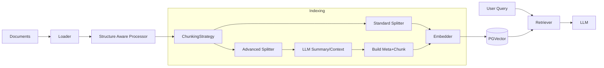

# Text RAG Algorithm Specification

## 1. 概述 (Overview)

文本 RAG (Retrieval-Augmented Generation) 是 AgentOS 多模态知识库的基础。本规范定义了文本数据的摄入、处理、索引、检索和生成流程。

针对复杂文档（如论文、长文），本规范引入了 **上下文感知 (Contextual Awareness)** 和 **分层索引 (Hierarchical Indexing)** 策略，以解决传统固定切片导致的信息碎片化问题。

## 2. 架构流程 (Architecture Pipeline)



## 3. 核心组件 (Core Components)

### 3.1 数据加载与结构化预处理 (Ingestion & Structural Preprocessing)

对于论文、研报等结构化文档，不能简单地视作纯文本流。

*   **Loader**:
    *   `PDFLoader`: 使用 `PyMuPDF` 或 `Unstructured` 提取内容。
    *   **Structure Extraction**: 识别 Title, Abstract, Sections (Introduction, Methods, Results), References。
    *   **Table/Figure Extraction**: 提取图表说明文字 (Caption) 并关联到最近的正文段落。

### 3.2 高级切片策略 (Advanced Chunking Strategy)

为应对不同类型文档，提供多种切片策略。

#### A. 基础策略 (Basic)
*   **Recursive Character Chunking**: 默认策略，按段落/句子递归切分。
*   **Semantic Chunking**: 基于 Embedding 相似度突变点切分。

#### B. 上下文感知策略 (Contextual & Meta-based) - **推荐用于论文/长文**

1.  **Sliding Window Summary (滑动摘要)**:
    *   **原理**: 防止切片丢失上下文（如代词指代不明）。
    *   **实现**: 在处理 Chunk `i` 时，将 `Chunk i-1` 的摘要作为 Context 输入给 LLM，生成 `Chunk i` 的摘要。
    *   **索引**: 向量化内容 = `Summary of Chunk i` + `Chunk i Content`。

2.  **Contextual Retrieval (上下文补全)**:
    *   **原理**: 孤立的 Chunk 往往缺乏全局信息（如“本文”、“该实验”指代什么）。
    *   **实现**: 对每个 Chunk，调用 LLM 生成一段解释性上下文。
        *   **短文档**: 可直接使用全文作为 Context。
        *   **长文档 (如论文)**: 采用 **两步法**。
            1.  先生成 **Document Summary (全局摘要)** 和 **Section Summary (章节摘要)**。
            2.  将 `Global Summary` + `Section Title/Summary` + `Current Chunk` 输入 LLM，生成该 Chunk 的具体上下文。
    *   **索引**: 向量化内容 = `Generated Context` + `Original Chunk`。
    *   **存储**: 原文存储 `Original Chunk`，但搜索时匹配 `Context + Chunk`。

3.  **Hierarchical Indexing (分层索引 / Parent Document Retriever)**:
    *   **原理**: 搜索小粒度（精准匹配），返回大粒度（提供完整语境）。
    *   **实现**:
        *   **Parent Chunk**: 大块，例如 2000 tokens。
        *   **Child Chunk**: 小块，例如 200-400 tokens，从 Parent Chunk 中切分。
    *   **索引**: 对 Child Chunk 进行向量化。
    *   **检索**: 搜索匹配 Child Chunk，但返回其所属的 Parent Chunk 给 LLM。

4.  **Hypothetical Questions (假设性问题)**:
    *   **原理**: 文档是陈述句，用户 Query 是疑问句，语义空间不一定对齐。
    *   **实现**: 对每个 Chunk，让 LLM 生成 3-5 个“该 Chunk 能回答的问题”。
    *   **索引**: 向量化这些生成的 Questions。

### 3.3 向量化 (Embedding)

*   **Content Construction**: 
    *   Standard: `vector(chunk_content)`
    *   Contextual: `vector(generated_context + chunk_content)`
    *   QA-based: `vector(generated_questions)`
*   **Models**: OpenAI `text-embedding-3-small` / `bge-m3`.

### 3.4 存储 (Storage)

Schema 升级以支持高级策略：

```sql
CREATE TABLE rag_documents (
    id UUID PRIMARY KEY DEFAULT gen_random_uuid(),
    collection_id UUID NOT NULL,
    title TEXT,
    structure_data JSONB, -- 存储提取的结构信息 (章节树)
    created_at TIMESTAMP DEFAULT NOW()
);

CREATE TABLE rag_chunks (
    id UUID PRIMARY KEY DEFAULT gen_random_uuid(),
    document_id UUID REFERENCES rag_documents(id),
    
    -- 内容
    content TEXT NOT NULL, -- 原始文本 (用于生成答案)
    
    -- 索引内容 (用于计算向量，可能包含 Summary/Context/Questions)
    index_content TEXT, 
    
    -- 向量
    vector VECTOR(1536),
    
    -- 结构信息
    chunk_index INTEGER,
    parent_chunk_id UUID, -- 用于分层索引
    
    -- Meta 信息
    metadata JSONB, -- { "page": 1, "section": "Introduction", "is_table_caption": true }
    
    created_at TIMESTAMP DEFAULT NOW()
);

CREATE INDEX ON rag_chunks USING hnsw (vector vector_cosine_ops);
```

### 3.5 检索 (Retrieval)

算法封装为 `Retriever` 接口。

1.  **Multi-Stage Retrieval**:
    *   **Step 1**: 向量检索 (Dense Retrieval) + 关键词检索 (Sparse Retrieval)。
    *   **Step 2 (For Hierarchical)**: 如果命中 Child Chunk，自动映射回 Parent Chunk。
    *   **Step 3 (Reranking)**: 使用 Cross-Encoder 对候选集重排序。
2.  **Context Window Expansion (上下文窗口扩展)**:
    *   **原理**: 检索到 Chunk `i` 后，自动获取 `Chunk i-k` 到 `Chunk i+k` 的内容，恢复因切片断裂的上下文。
    *   **幻觉抑制 (Hallucination Mitigation)**:
        *   **Reranking**: 对扩展后的内容块整体打分，确保增加的内容确实提升了相关性。
        *   **System Prompt**: 明确指示模型“以下内容可能包含相邻上下文，请根据问题筛选相关信息，忽略无关部分”。
3.  **Metadata Filtering**: 允许用户限定检索范围（如“只看 Method 章节”）。

## 4. 数据流转示例 (Data Flow Example)

假设我们处理一篇关于 **“深度学习在医学影像中的应用”** 的中文论文。

### Step 1: Ingestion & Chunking (摄入与切片)
*   **Original Text (Chunk 10)**: “它在测试集上达到了 98.5% 的准确率。”
*   **Issue**: 单独看这句话，不知道“它”指的是什么模型，也不知道是哪个数据集。

### Step 2: Contextual Enrichment (语境补全 - 索引阶段)
*   **Strategy**: Contextual Retrieval (上下文补全 - 长文档模式)
*   **Pre-computation**: 先生成全局摘要：“本文提出了改进版 ResNet-50 用于胸部 X 光片分类...”
*   **LLM Action**: 输入 `Global Summary` + `Current Chunk`，生成 Chunk 上下文。
*   **Generated Context**: “本段落讨论了提出的 **ResNet-50 改进模型** 在 **ChestX-ray14 数据集** 上的性能表现。”
*   **Index Content**: “本段落讨论了提出的 ResNet-50 改进模型在 ChestX-ray14 数据集上的性能表现。它在测试集上达到了 98.5% 的准确率。”
*   **Vector**: Embedding(Index Content) -> `vector_A`

### Step 3: Retrieval (检索 - 查询阶段)
*   **User Query**: “ResNet 模型在胸部 X 光片上的表现如何？”
*   **Vector Search**: Query Vector 与 `vector_A` 高度匹配（因为包含了“ResNet”、“ChestX-ray”、“表现”等语义信息）。

### Step 4: Window Expansion (上下文扩展 - 后处理)
*   **Hit**: Chunk 10
*   **Expansion**: 自动获取 Chunk 9 + Chunk 10 + Chunk 11。
    *   *Chunk 9*: “我们对模型进行了 100 个 epoch 的训练，使用了 Adam 优化器...”
    *   *Chunk 10*: “它在测试集上达到了 98.5% 的准确率。”
    *   *Chunk 11*: “然而，在存在胸腔积液的病例中，敏感度较低...”
*   **Final Context to LLM**: Chunk 9 + 10 + 11.

### Step 5: Generation (生成)
*   **LLM Output**: “基于 ResNet-50 的改进模型在 ChestX-ray14 测试集上达到了 98.5% 的准确率。不过，文中也指出在胸腔积液病例中其敏感度相对较低。”

## 5. 接口定义 (Interface Definition)

```typescript
interface IRAGService {
  // 索引 - 支持指定策略
  ingest(
    file: File, 
    options: {
      strategy: 'recursive' | 'contextual' | 'hierarchical',
      chunkSize?: number
    }
  ): Promise<DocumentId>;
  
  // 检索
  retrieve(query: string, options: RetrievalOptions): Promise<Chunk[]>;
  
  // 生成
  chat(query: string, history: Message[]): Promise<Stream<string>>;
}
```
