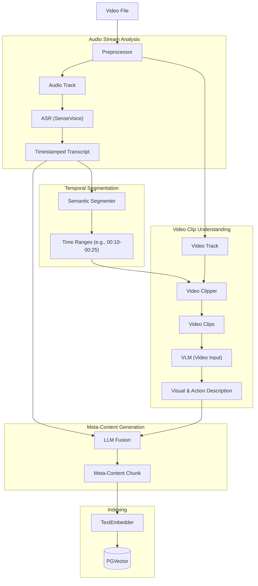

# Video RAG Algorithm Specification

## 1. 概述 (Overview)

Video RAG 旨在实现对视频内容的多模态深度理解与检索。本方案采用 **"Audio-Driven Segmentation + VLM Video Understanding"** 的策略。

这个方案是 **Image RAG** (视觉语义) 和 **Audio RAG** (听觉/时序语义) 的有机集合，并针对视频的连续性特征进行了工程化整合。

核心理念是：**以音频叙事为时间轴基准，利用支持视频输入的 VLM 捕捉连续视觉信息**。

流程简述：
1.  **听 (Listen)**: 提取音频，进行高精度 ASR 识别，获取带时间戳的字幕文本 (复用 Audio RAG 能力)。
2.  **切 (Segment)**: 基于字幕的语义停顿（句号、静音）将视频切分为语义完整的 **Video Clips**。
3.  **看 (Watch)**: 将 Video Clip 投喂给 VLM，提取动作、运镜、屏幕文字等动态视觉信息 (升级版 Image RAG 能力)。
4.  **融 (Fuse)**: 结合“听到的内容”和“看到的内容”，生成结构化的 **Meta-Content Chunk**。

## 2. 架构流程 (Architecture Pipeline)



## 3. 核心组件 (Core Components)

### 3.1 音频驱动切分 (Audio-Driven Segmentation)

视频的叙事通常由语音主导。我们利用音频的自然停顿来确定切分点，避免破坏语义完整性。这比传统的固定时间窗口或纯视觉转场检测更符合人类对视频内容的理解逻辑。

*   **ASR Model**: 复用 **Audio RAG** 中的 **SenseVoiceSmall**。
    *   **Input**: 视频分离出的音频流。
    *   **Output**: 带有精确时间戳（Start, End）的富文本（包含情感、事件）。
*   **Segmentation Logic**:
    *   **基于句子**: 以完整的句子（句号/问号）为基础单元。
    *   **时间窗口聚合**: 动态合并短句，确保每个 Clip 的长度适中（例如 10s ~ 60s），避免碎片化。
    *   **静音/事件检测**: 利用 VAD (Voice Activity Detection) 和 AED (Audio Event Detection) 辅助确定切分边界（例如掌声结束后切分）。
    *   **Fallback**: 如果视频无语音（如监控录像、默片），则自动回退到基于视觉场景检测 (PySceneDetect) 或固定时间窗口切分。

### 3.2 视频片段理解 (Video Clip Understanding)

利用新一代 VLM 的视频理解能力，直接处理连续帧，捕捉静态图片无法体现的“动作”和“变化”。这是 **Image RAG** 的时间维度升级版。

*   **Model**: 支持 Video 输入的 VLM (如 GPT-4o, Gemini 1.5 Pro, Video-LLaVA, Qwen2-VL)。
*   **Input**: 
    *   **Video Clip**: 根据上述时间范围切分出的视频片段（通常抽样为 8-16 帧序列）。
    *   **Context**: 该片段对应的 ASR 字幕文本（作为 Prompt 提示词，辅助 VLM 聚焦）。
*   **Task**: 要求 VLM 生成以下维度的描述：
    *   **Action (动作)**: 人物在做什么（跑、跳、演讲、操作电脑）。
    *   **Scene (场景)**: 环境及其变化（从室内走到室外）。
    *   **Visual Text (OCR)**: 屏幕或物体上出现的关键文字（PPT 内容、路牌）。
    *   **Atmosphere (氛围)**: 紧张、欢快、严肃。

### 3.3 Meta-Content Fusion (核心融合)

将 ASR 提取的“显式信息”与 VLM 提取的“隐式视觉信息”融合，生成类似 **Image RAG** 中定义的 Meta-Content，但增加了时间维度。

*   **Input**: 
    *   Segment Transcript (ASR): "我们来看这个架构图，它分为三层..."
    *   Visual Description (VLM): "演讲者手指指向屏幕中央的 'Service Layer' 模块，屏幕显示着蓝色的方块图。"
*   **Process**: LLM 整合并纠偏。
*   **Output**: Meta-Content Chunk。

### 3.4 Meta-Content Chunk 格式

```markdown
<meta>
[Source]: product_demo.mp4
[Time_Range]: 00:02:15 - 00:02:45
[Speaker]: Speaker A (Male)
[Visual_Tags]: Presentation, Architecture Diagram, Pointer, Meeting
</meta>

<content>
【语音内容】
Speaker A: "核心的中间层是 Service Layer，它负责处理所有的业务逻辑和工作流调度。大家可以看到，这里使用了微服务架构。"

【视觉画面】
画面展示了一张系统架构图 PPT。演讲者站在屏幕右侧，手持激光笔圈出了中间蓝色的 "Service Layer" 区域。PPT 上方标题写着 "System Architecture v2.0"。

【综合摘要】
演讲者正在结合架构图 PPT 详细讲解 Service Layer 的职责（业务逻辑与调度）及其微服务架构设计。
</content>
```

### 3.5 存储 (Storage)

使用单一宽表存储切分后的 Video Chunks，便于统一检索。

```sql
CREATE TABLE rag_video_chunks (
    id UUID PRIMARY KEY DEFAULT gen_random_uuid(),
    video_id UUID REFERENCES rag_videos(id),
    
    -- 时序定位 (Temporal Localization)
    start_time FLOAT NOT NULL,
    end_time FLOAT NOT NULL,
    
    -- 内容数据 (Content)
    meta_content TEXT NOT NULL,  -- 用于全文检索和 LLM 上下文 (Human-readable format)
    content_vector VECTOR(1536), -- 文本向量 (Embedding of meta_content)
    
    -- 原始数据索引 (Raw Data References for debugging/UI)
    transcript TEXT,             -- 原始字幕
    visual_summary TEXT,         -- VLM 视觉总结
    
    -- 元数据 (Metadata)
    speaker_id TEXT,             -- 说话人标识
    tags TEXT[],                 -- 视觉标签
    
    created_at TIMESTAMP DEFAULT NOW()
);

CREATE INDEX ON rag_video_chunks USING hnsw (content_vector vector_cosine_ops);
```

## 4. 检索策略 (Retrieval Strategy)

统一转化为文本向量检索，支持“搜内容”、“搜画面”、“搜动作”。

1.  **Text Query**: 用户输入 "Find the part where he explains the service layer" 或 "Show me the blue architecture diagram".
2.  **Vector Search**: 检索 `content_vector`。
    *   由于 Meta-Content 包含了 "Service Layer" (语音提及) 和 "blue architecture diagram" (视觉描述)，无论用户描述的是听到的还是看到的，都能命中。
3.  **Result Presentation**: 
    *   返回匹配的 Video Chunk。
    *   前端播放器直接跳转到 `start_time` 开始播放。

## 5. 接口定义 (Interface Definition)

```typescript
interface IVideoRAGService {
  /**
   * 视频入库流程：
   * 1. Extract Audio -> ASR -> Transcript with Timestamps
   * 2. Segment Transcript -> Time Ranges (Audio-Driven Segmentation)
   * 3. Extract Video Clips by Time Ranges
   * 4. VLM Understanding (Clip + Transcript) -> Visual Description
   * 5. Fuse -> Meta-Content
   * 6. Embedding & Save
   */
  ingest(videoFile: File, options: VideoIngestionOptions): Promise<VideoId>;
  
  /**
   * 检索
   * 返回包含时间戳的视频片段结果
   */
  search(query: string, options: SearchOptions): Promise<VideoChunkResult[]>;
  
  /**
   * 获取流地址（支持 Range 请求，用于跳转播放）
   */
  getStreamUrl(videoId: string): string;
}

type VideoChunkResult = {
  chunkId: string;
  videoId: string;
  timeRange: [number, number]; // [start, end] in seconds
  score: number;
  content: string; // The Meta-Content text summary
  thumbnailUrl: string; // Screenshot at start_time
};
```
