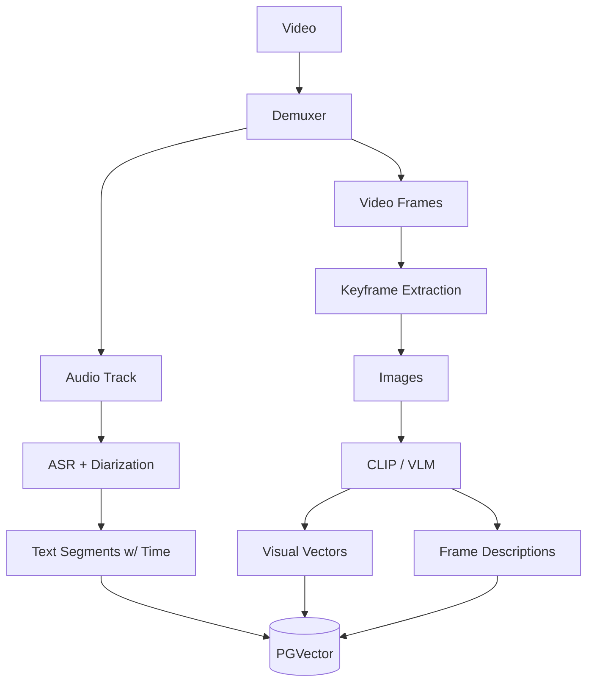

# Video RAG Algorithm Specification

## 1. 概述 (Overview)

视频 RAG 是多模态 RAG 中最复杂的一种，因为视频包含了视觉（图像序列）、听觉（音频）和时间信息。Video RAG 的策略本质上是 Image RAG + Audio RAG + Time-Series Logic 的组合。

## 2. 架构流程 (Architecture Pipeline)



## 3. 核心组件 (Core Components)

### 3.1 拆解与提取 (Decomposition)

1.  **Audio Track**:
    *   提取音频流，复用 **Audio RAG** 的处理流程（ASR -> Text -> Vector）。
    *   产出：带有时间戳的对话/语音文本。

2.  **Visual Track**:
    *   **Keyframe Extraction (关键帧提取)**:
        *   **Fixed Interval**: 每秒提取 1 帧 (1 FPS) 或每 5 秒 1 帧。
        *   **Scene Detection (场景检测)**: 使用 `PySceneDetect` 检测场景切换点，提取每个场景的第一帧和中间帧。

### 3.2 视觉理解与索引 (Visual Understanding)

对提取出的 Keyframes 进行处理：

1.  **Dense Visual Indexing**:
    *   使用 **CLIP/SigLIP** 对关键帧进行 Embedding。
    *   记录时间戳 (Timestamp)。

2.  **Dense Captioning**:
    *   使用 **VLM (Video-LLaVA / GPT-4o-video)** 对关键帧或短视频片段 (Video Clip) 生成描述。
    *   描述包含：动作、物体、环境、文字 (OCR)。
    *   将描述文本向量化。

### 3.3 存储 (Storage)

Schema 设计：

```sql
CREATE TABLE rag_videos (
    id UUID PRIMARY KEY DEFAULT gen_random_uuid(),
    collection_id UUID NOT NULL,
    file_path TEXT,
    duration FLOAT,
    metadata JSONB,
    created_at TIMESTAMP DEFAULT NOW()
);

-- 视频是多模态混合存储
-- 1. 音频转录存储在 rag_audio_segments (关联 video_id)
-- 2. 视觉帧存储在 rag_video_frames

CREATE TABLE rag_video_frames (
    id UUID PRIMARY KEY DEFAULT gen_random_uuid(),
    video_id UUID REFERENCES rag_videos(id),
    timestamp FLOAT NOT NULL, -- 帧出现的时间
    frame_path TEXT, -- 帧图片存储路径
    
    visual_vector VECTOR(512), -- CLIP 向量
    caption TEXT, -- 帧描述
    caption_vector VECTOR(1536), -- 描述文本向量
    
    created_at TIMESTAMP DEFAULT NOW()
);
```

### 3.4 检索策略 (Retrieval Strategy)

1.  **Text-to-Video Retrieval**:
    *   Query: "Find the scene where a man is running on the beach."
    *   **Visual Search**: 将 Query 映射到 CLIP 空间，搜索 `rag_video_frames` 中的 `visual_vector`。
    *   **Caption Search**: 将 Query 映射到 Text 空间，搜索 `rag_video_frames` 中的 `caption_vector`。
    *   **Audio Search**: 同时搜索 `rag_audio_segments`，看是否有相关对话或背景音描述。
    *   **Temporal Alignment (时序对齐)**:
        *   如果在相近时间戳（如 5秒窗口内）同时匹配到了视觉和音频信号，则该片段的相关性得分极高。
        *   聚合相邻的匹配帧，形成一个 Video Clip (e.g., 00:10 - 00:25)。

2.  **Video QA**:
    *   检索相关 Video Clips。
    *   将 Clips 的视觉描述（或采样帧）+ 音频转录作为 Context 提供给 LLM。

## 4. 接口定义 (Interface Definition)

```typescript
interface IVideoRAGService {
  // 索引
  ingest(videoFile: File, options: VideoOptions): Promise<VideoId>;
  
  // 检索
  search(query: string, options: SearchOptions): Promise<VideoClip[]>;
  
  // 播放
  getStreamUrl(videoId: string, range: TimeRange): string;
}

type VideoClip = {
  videoId: string;
  startTime: number;
  endTime: number;
  score: number;
  thumbnail: string;
  reason: string; // "Matched visual content: running on beach"
};
```
