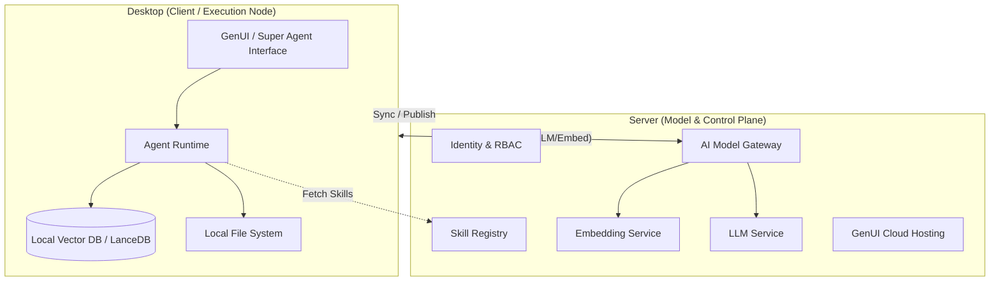

# AgentOS Desktop & Server 架构技术规格说明书 (SPEC)

## 1. 概述 (Overview)

本规格说明书定义了 AgentOS 核心系统 **Desktop (客户端)** 与 **Server (服务端)** 的技术架构与功能规范。基于 **"Cloud-Powered AI, Local Execution"** 的设计理念，AgentOS 旨在构建一个结合云端强大模型能力与本地隐私数据管理的 Agent 运行环境。所有 AI 模型推理（LLM, Embedding 等）均通过 Server 进行，Desktop 端专注于交互、工具执行与本地数据管理。

**子文档**:
*   [Server Spec](server_spec.md): 服务端详细设计 (API, DB, Services)。
*   [Desktop Spec](desktop_spec.md): 客户端详细设计 (Electrobun, Local Runtime, IPC)。

## 2. 设计目标 (Design Goals)

1.  **云端 AI 驱动 (Cloud-Powered AI)**: 所有 AI 模型（包括 LLM、Embedding、语音/图像模型）均托管在 Server 端或通过 Server 代理调用，Desktop 端不运行任何本地 AI 模型。
2.  **本地执行与隐私 (Local Execution & Privacy)**: 虽然模型计算在云端，但 Agent 的工具执行（代码运行、文件操作）仍在 Desktop 端完成。本地数据（文档、笔记）在本地建立索引（向量值由 Server 生成），检索过程优先在本地完成。
3.  **轻量级客户端 (Lightweight Client)**: 移除本地模型推理依赖，降低 Desktop 端的硬件门槛（无需高性能 NPU/GPU），减小安装包体积。
4.  **统一模型管理 (Unified Model Management)**: 由 Server 统一管理模型接入、密钥配置与计费，Desktop 端无需关心底层模型实现。
5.  **无缝云端协作 (Cloud Collaboration)**: 提供 Skill 市场、GenUI 云端托管及重型任务卸载能力，扩展本地 Agent 的能力边界。

## 3. 系统架构 (System Architecture)

系统由 **Desktop (Client / Execution Node)** 和 **Server (Model & Control Plane)** 两大核心部分组成。

### 3.1 架构图示

### 3.2 核心组件

#### 3.2.1 Desktop (Client / Execution Node)
Desktop 是用户交互与任务执行环境，承担以下职责：
-   **Agent Runtime**: 负责 Prompt 组装、工具调用 (Tool Calling)、Context 管理及 Skill 执行。
-   **GenUI 容器**: 作为 GenUI 的设计器与运行环境。
-   **本地数据层**: 负责本地数据的存储与检索。虽然 Embedding 向量由 Server 生成，但向量库（LanceDB）仍部署在本地，以支持快速检索和数据隐私（原始文本不出域，仅向量特征值可能经过云端）。

#### 3.2.2 Server (Model & Control Plane)
Server 是模型网关与控制平面，承担以下职责：
-   **AI Model Gateway**: 统一封装 LLM 和 Embedding 模型的调用接口，支持对接 OpenAI、Anthropic 或自建模型服务。
-   **Skill Registry**: 管理 Skill/Flow 的版本、分发与流转。
-   **Identity & Sync**: 负责用户认证、配置同步及多端状态一致性。

## 4. 关键技术栈：混合向量化 (Hybrid Vectorization)

采用“云端计算，本地存储”的混合模式。

| 组件 | 选型 | 理由 |
| :--- | :--- | :--- |
| **向量数据库** | **LanceDB** (Local) | 保持本地存储架构，实现快速检索，支持离线查看（已索引内容）。 |
| **Embedding** | **Server API** | 移除本地 ONNX 依赖，利用 Server 端更强大的模型（如 OpenAI text-embedding-3）。 |
| **通信协议** | **gRPC / HTTP2** | 优化 Desktop 与 Server 间传输大量向量数据的性能。 |

**数据处理流水线**:
1.  **Ingestion**: Desktop 监听文件变动 -> 文本提取。
2.  **Chunking**: Desktop 进行文本切片。
3.  **Remote Embedding**: Desktop 将文本块批量发送至 Server `/embeddings` 接口。
4.  **Indexing**: Server 返回向量，Desktop 将其存入本地 LanceDB。
5.  **Retrieval**: Desktop 将用户 Query 发送至 Server 获取向量 -> 在本地 LanceDB 进行 ANN 搜索 -> 返回 Top-K。

## 5. 实施规划 (Implementation Roadmap)

### Phase 1: 基础架构 (Foundation)
-   **Server**: 搭建 AI Gateway，实现 LLM 与 Embedding 接口转发；建立账户体系。
-   **Desktop**: 构建应用框架，实现 Remote Model Client，移除本地模型相关代码。

### Phase 2: 核心能力 (Core Capabilities)
-   **Server**: 上线 Skill Registry。
-   **Desktop**: 实现基于 Remote Embedding 的本地 RAG 流程；提供 Super Agent 界面。

### Phase 3: 生态与融合 (Ecosystem & Fusion)
-   **Server**: 增强 AI Gateway 的路由与计费策略。
-   **Desktop**: 深度集成 OS，实现基于云端视觉模型的 Computer Use。
