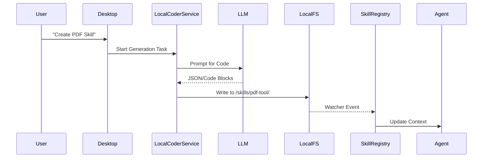

# Skill Integration Spec: Local-First Architecture (Local Generation & Optional Sync)

## 1. 概述 (Overview)

本设计文档旨在规范 AgentOS Desktop 的 Skill 集成方式。核心理念是 **"Local-First"**（本地优先）。

目标：
1.  **本地生成**: Desktop 应用集成 Coder Agent 能力，直接在本地生成 Skill 代码并保存到本地文件系统。
2.  **本地执行**: 生成的 Skill 由本地 Sandbox 运行，保持完全的数据隐私和低延迟。
3.  **可选云端同步**: 默认情况下 Skill 仅保存在本地。只有当用户明确选择 **"Public" (发布)** 时，才将 Skill 上传至云端市场。
4.  **零侵入导入**: 兼容用户手动放入的 Skill 文件夹。

## 2. 架构设计 (Architecture)

### 2.1 核心组件 (packages/agent)

`packages/agent` 需提供通用的 Coder 能力，使其能在 Desktop 环境（Bun）中运行。

*   **`Coder`**: 代码生成核心逻辑，接收 Prompt，生成文件结构。需解耦文件系统操作，支持传入 `FileSystem` 接口或直接操作本地 FS。
*   **`SkillManager`**: 负责聚合 Skill，生成 Prompt Context。
*   **`ISkillProvider`**: 获取 Skill 列表。

### 2.2 Desktop 服务层 (projects/desktop)

#### A. SkillRegistry (LocalFileSystemSkillProvider)
*   **职责**: 管理本地 Skill 目录 (`~/Desktop/AgentOS/skills`)。
*   **逻辑**: 扫描目录，解析 `SKILL.md`，维护 Skill 列表。
*   **Execution Config**: 自动将本地路径设为 `rootPath`。

#### B. LocalCoderService (Generation Service)
*   **职责**: 在本地运行 Skill 生成任务。
*   **流程**:
    1.  用户输入需求。
    2.  调用 `@agentos/agent` 的 `Coder` 模块。
    3.  LLM 生成代码结构。
    4.  服务将代码直接写入本地目录 `~/Desktop/AgentOS/skills/<new-skill>`.
    5.  `SkillRegistry` 自动发现。

#### C. SkillSyncService (Publish/Sync)
*   **职责**: 处理 Skill 的发布和更新。
*   **逻辑**:
    *   **Default**: 新生成的 Skill 标记为 `local-only`。
    *   **Publish**: 用户点击 "Publish" -> 打包本地文件夹 -> 上传云端 -> 更新状态为 `synced` (Public)。
    *   **Update**: 已发布的 Skill 本地修改后 -> 提示 "Sync to Cloud"。

### 2.3 数据流 (Workflows)

#### 流程 1: 本地生成 Skill (Local Creation)


#### 流程 2: 发布到云端 (Publish)
*   用户在 Skill 详情页点击 "Make Public"。
*   Desktop 调用 `POST /api/v1/skills/publish`。
*   上传 Zip 包 + 元数据。
*   云端返回 `skillId`，本地更新 `cloudConfig`。

## 3. 接口定义 (Interfaces)

### 3.1 Skill Type Definition

```typescript
// packages/agent/src/skill/types.ts

export type SkillExecutionConfig = {
  rootPath?: string;      // 本地绝对路径
  env?: Record<string, string>;
  dependencies?: string[];
};

export type SkillCloudConfig = {
  skillId?: string;       // 云端 ID (仅当已发布时存在)
  version?: string;
  isPublic: boolean;      // 关键字段：是否公开
  syncStatus: 'synced' | 'modified' | 'local-only';
  lastSyncedAt?: Date;
};

export type Skill = {
  metadata: SkillMetadata;
  coreContent: string;
  chunks: Map<string, SkillChunk>;
  
  // 运行时配置
  executionConfig?: SkillExecutionConfig;
  
  // 云端同步状态
  cloudConfig: SkillCloudConfig; 
};
```

## 4. Desktop 实现细节

### 4.1 目录结构
保持不变，依旧是扁平结构。

### 4.2 LocalCoderService 实现

需要复用 `packages/agent` 中的 Coder。

```typescript
// projects/desktop/src/bun/service/coder.ts

import { Coder } from '@agentos/agent/coder';

export class LocalCoderService {
  async generateSkill(prompt: string) {
    // 1. Construct system prompt for Skill Generation
    // 2. Call LLM
    // 3. Parse result
    // 4. Write files to disk
  }
}
```

## 5. Action Items

1.  **Refactor `packages/agent`**:
    *   更新 `Skill` 类型 (`cloudConfig` 增加 `isPublic`)。
    *   确保 `Coder` 模块可以在 Desktop (Bun) 环境下无缝运行（检查依赖）。
2.  **Desktop Implementation**:
    *   实现 `LocalCoderService`。
    *   实现 `SkillSyncService` (Publish logic)。
    *   UI 增加 "Publish" 按钮和状态显示。
