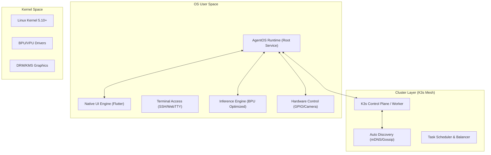

# AgentOS OS 产品线设计规格说明书 (SPEC) - RDK X5 Edge Edition

## 1. 产品概述 (Overview)

**AgentOS Edge (RDK Edition)** 是专为 **地平线 RDK X5** 等边缘计算设备设计的嵌入式操作系统。它不仅仅是一个 OS，更是一个**以 Agent 为核心 (Agent-First)** 的智能集群节点。

### 1.1 核心理念
- **Agent 第一公民 (Agent as First Citizen)**: Agent 拥有与人类同级甚至更高的系统权限（Root 级），可直接管控硬件、网络和自身生命周期。
- **原生即正义 (Native Performance)**: 摒弃 Web 渲染，采用原生图形栈（Flutter/Qt），充分利用边缘设备的 GPU/NPU 资源。
- **蜂群智能 (Swarm Intelligence)**: 设备间自动组网，形成算力与技能（Skill）的共享网格，实现任务的自动流转与负载均衡。

## 2. 硬件与环境 (Hardware & Environment)

- **目标设备**: 地平线 RDK X5 (Horizon RDK X5)
- **架构**: ARM64 (Cortex-A55) + BPU (Bernoulli 2, 10 TOPS)
- **操作系统基座**: Ubuntu 22.04 LTS (Server Core) 或 Buildroot 定制版
- **网络环境**: 局域网自动发现，支持 Wi-Fi/Ethernet 混合组网

## 3. 系统架构 (System Architecture)

系统采用 **Micro-Service Cluster** 架构，单机即集群，多机自动 Mesh。



## 4. 关键特性详解

### 4.1 原生 UI 渲染 (Native Rendering)
为了满足“轻量”且“Agent 可控”的需求，放弃 Electron/Browser 方案。
- **技术选型**: **Flutter** (Embedded Linux)
  - **理由**: 高性能 (Skia/Impeller)，AOT 编译，内存占用低，支持 DRM/KMS 直接渲染（无需 X11/Wayland 桌面环境）。
- **Agent 控制机制**:
  - UI 不再是静态的页面，而是 **响应式的数据投影**。
  - Agent 通过 gRPC/Socket 发送 `UI_State_Tree` (JSON/Protobuf)。
  - Flutter 引擎解析状态树并进行原生绘制。
  - **示例场景**: Agent 检测到摄像头有人，自动在 UI 上创建一个视频预览窗口并添加“问候”按钮，无需人类预先编写代码。

### 4.2 自动组网与集群 (Auto-Mesh & K8s)
实现设备上电即组网，无需人工干预。为了解决“Docker 太重”的问题，我们采用极致轻量化的运行时栈。
- **容器编排**: 集成 **K3s** (Lightweight Kubernetes)。
  - **Runtime**: 彻底移除 Docker Daemon，直接使用 **Containerd** (配合 K3s 内置)。
  - **Skill Isolation**: 引入 **WasmEdge (WebAssembly)** 作为 Skill 的执行沙箱。相比 Docker 容器，Wasm 模块启动时间在微秒级，内存占用仅为 MB 级，且支持 K8s 调度 (via crun/wasmedge)。
- **服务发现**: 使用 **Avahi (mDNS)** 和 **Gossip 协议** 广播自身能力（CPU/内存/BPU 空闲率、已安装 Skills）。
- **负载均衡**:
  - 任务分发器根据网络内节点的负载情况，将 Skill 执行任务（Wasm Module 或 Pod）调度到最优节点。
  - 支持 **MCP (Model Context Protocol)** 的跨设备流转：Agent A (客厅) 可以直接调用 Agent B (卧室) 连接的传感器 MCP。

### 4.3 Agent 运维与权限 (Agent Ops)
Agent 是系统的最高管理员。
- **自运维**: Agent 监控 K8s 集群状态 (`kubectl get nodes`)，自动清理僵尸容器，扩缩容 Pod。
- **系统控制**: Agent 拥有 `sudo` 免密权限，可执行：
  - `apt-get install` / `apk add` 安装系统依赖。
  - `reboot` / `shutdown`。
  - 修改 `/etc/network/interfaces` 调整网络配置。
- **安全边界**: 虽然 Agent 权限高，但通过 **Seccomp** 和 **Namespace** 隔离其生成的不可信 Skill 代码，防止 Skill 破坏宿主机。

### 4.4 本地模型优先 (Local Model First)
- **推理引擎**: 深度集成地平线 **BPU** 工具链。
  - 使用 **Hobot DNN** 或 **ONNX Runtime (EP: BPU)** 加速推理。
  - 预装量化后的模型 (如 Qwen-1.8B-Int4, Llama-3-8B-Quant)，确保在 RDK X5 上流畅运行。
- **云端协作**:
  - **仅**在需要生成新 Skill 代码（复杂逻辑生成）时，连接云端大模型 (GPT-4/Claude-3.5)。
  - 日常对话、决策、设备控制完全在本地 NPU 完成。

### 4.5 混合人机控制 (Hybrid Control)
尽管 Agent 拥有极高权限，但人类用户始终保留最终控制权。
- **终端接入 (Terminal Access)**:
  - **SSH**: 默认开启 SSH 服务 (Port 22)，允许用户远程登录进行系统维护。
  - **Overlay Terminal**: 在 Kiosk UI 中通过快捷键 (如 `Ctrl+Alt+T`) 唤起透明浮层终端，直接操作底层 Shell。
- **权限优先级**:
  - **Kill Switch**: 人类通过终端发出的指令 (如 `kill -9`) 拥有最高优先级，可随时强制终止失控的 Agent 进程。
  - **Override**: 用户可以锁定特定硬件资源 (如 GPIO)，禁止 Agent 访问，确保物理安全。

## 5. Agent 统一协议 (AUP - Agent Unified Protocol)

为了实现 Agent 间的无缝协作、任务自动切片与分发，我们设计了 **AUP (Agent Unified Protocol)**。这是一套基于 JSON-RPC / CloudEvents 的语义化通信标准。

### 5.1 协议核心设计
所有实体（Task, MCP, Skill, Plugin）在协议中统一视为 **Resource** 或 **Capability**，所有交互统一视为 **Message**。

```typescript
interface AgentMessage<T = any> {
  ver: "1.0";           // 协议版本
  id: string;           // 消息唯一ID (UUID)
  traceId: string;      // 分布式追踪ID，用于串联整个任务链
  type: MessageType;    // 消息类型
  source: string;       // 发送方 Agent ID (e.g., "agent://rdk-node-1/supervisor")
  target: string;       // 接收方 (e.g., "agent://rdk-node-2/worker-gpu") 或 "broadcast"
  payload: T;           // 具体数据
  meta?: Record<string, any>; // 元数据 (优先级、超时、负载要求)
}

enum MessageType {
  // 任务生命周期
  TASK_SUBMIT = "task.submit",
  TASK_SLICE = "task.slice",       // 任务切片分发
  TASK_RESULT = "task.result",
  
  // 动态编排
  AGENT_SPAWN = "agent.spawn",     // 拉起新 Agent
  AGENT_KILL = "agent.kill",
  
  // 能力调用 (MCP/Skill)
  CAPABILITY_DISCOVER = "cap.discover",
  CAPABILITY_CALL = "cap.call",
  
  // UI 投影
  UI_UPDATE = "ui.update"
}
```

### 5.2 任务切片与自动流转 (Task Slicing & Flow)
Agent 不再单打独斗，而是作为一个组织运作。

1.  **接收 (Ingest)**: Root Agent 接收自然语言复杂任务（例如：“监控客厅温度，超过30度时打开风扇并通知我”）。
2.  **切片 (Slicing)**:
    *   Root Agent 调用 Planner 模型，将任务分解为 DAG (有向无环图)。
    *   SubTask A: "Read Temperature" (需要 Sensor 权限)。
    *   SubTask B: "Control Fan" (需要 GPIO 权限)。
    *   SubTask C: "Notify User" (需要 Network 权限)。
3.  **分发 (Dispatch)**:
    *   Root Agent 发送 `CAPABILITY_DISCOVER` 广播。
    *   Node 1 (Sensor Agent) 响应能处理 SubTask A。
    *   Node 2 (GPIO Agent) 响应能处理 SubTask B。
    *   若无现有 Agent 能处理，Root Agent 发送 `AGENT_SPAWN` 指令，通过 K3s 启动一个新的 Pod 加载所需 Skill。
4.  **执行与串联 (Execution & Chaining)**:
    *   各 Agent 并行/串行执行 SubTask。
    *   通过 `traceId` 将所有 `TASK_RESULT` 汇聚回 Root Agent。

### 5.3 MCP 与 Skill 的统一封装
为了让 Agent 理解 Plugin 和 Skill，它们都被封装为 **MCP Server**。
*   **Skill**: 本地 Python/JS 函数 -> 封装为 MCP Tool。
*   **Plugin**: 外部 API (如 Weather API) -> 封装为 MCP Resource。
*   **Agent**: 自身也是一个 MCP Client (调用者) 和 Server (被调用者)。

## 6. 数据流转 (Data Flow)

1.  **感知**: 摄像头/麦克风 -> HAL -> 本地多模态模型 (BPU)。
2.  **决策**: 本地 LLM 生成 Plan。
3.  **执行**:
    - **本地**: 调用 HAL 控制 GPIO/电机。
    - **UI**: 发送指令更新 Flutter 界面。
    - **集群**: 若任务繁重，打包任务为 Pod，提交给 K3s 调度到空闲的 RDK 节点。

## 7. 开发路线图 (Roadmap)

### Phase 1: 基础系统 (Base System)
- [ ] 构建适配 RDK X5 的 Ubuntu 镜像，预装 K3s, Docker, Flutter Engine。
- [ ] 验证 BPU 上的 LLM 推理性能。

### Phase 2: 核心运行时 (Core Runtime)
- [ ] 移植 `AgentRuntime` 到 Node.js 服务。
- [ ] 实现 Agent 控制 Flutter UI 的通信协议。
- [ ] 实现基于 mDNS 的 K3s 自动发现脚本。

### Phase 3: 协议与蜂群 (Protocol & Swarm)
- [ ] 定义并实现 AUP (Agent Unified Protocol) SDK。
- [ ] 实现任务切片器 (Task Slicer) 和调度器。
- [ ] 实现跨设备的 MCP 调用代理。

## 8. 目录结构建议

```
projects/os/
├── build/
│   ├── rdk-x5/             # RDK X5 镜像构建脚本
│   └── k3s/                # K3s 预配置文件 (Manifests)
├── src/
│   ├── protocol/           # AUP 协议定义与 SDK (TS/Python)
│   ├── runtime/            # AgentOS 核心守护进程
│   ├── ui/                 # Flutter 原生 UI 项目
│   ├── hal/                # RDK X5 硬件控制库 (Binding)
│   └── cluster/            # 自动组网与发现逻辑
└── package.json
```
